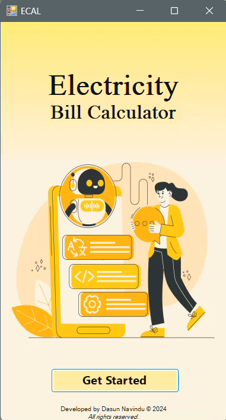
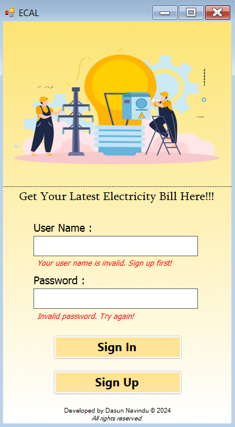
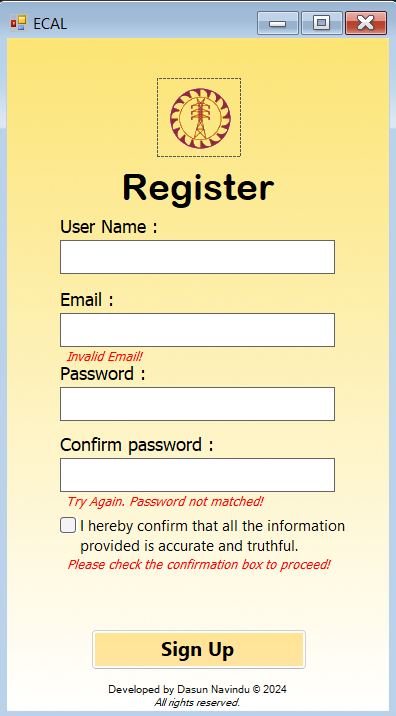
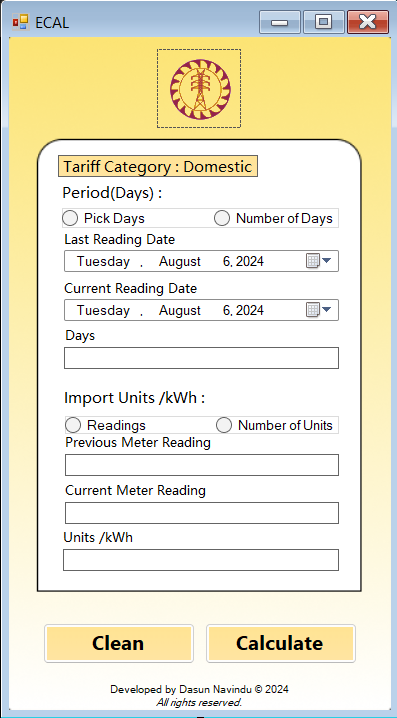
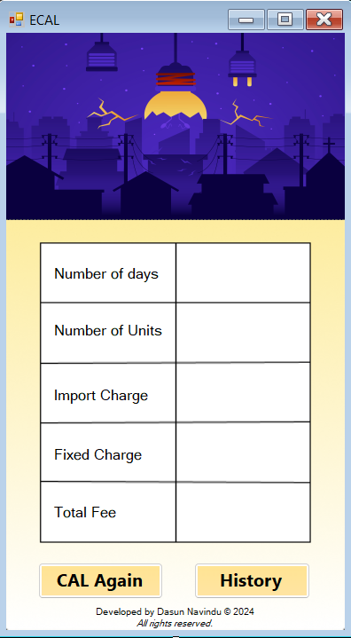
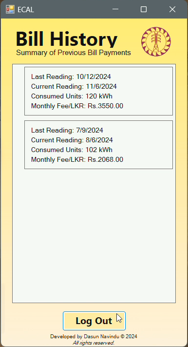

# Electricity Bill Calculator

## Overview
This is an Electricity Bill Calculator app developed using C# and Windows Forms (.NET Framework). The application allows users to sign up, sign in, calculate electricity bills, display the calculation, and maintain a history of past bills. The app is designed to make managing electricity consumption simple and efficient.

## Application Pages
The application includes six main pages:

1. **Home Page**: Introduction and navigation for users to sign in or sign up.
2. **Sign-In Page**: Allows existing users to sign in with their credentials.
3. **Sign-Up Page**: Enables new users to create an account with form validation to ensure accurate data entry.
4. **Calculate Page**: Users can input their electricity usage details to calculate the bill based on days or units consumed.
5. **Calculate Display Page**: Displays the calculated bill, including import charges, fixed charges, tax rate, and billing period.
6. **Bill History Page**: Shows a history of previous bill calculations for the user.

## Features
- **User Registration**: New users can create an account with basic details.
- **User Login**: Existing users can log in to access the bill calculation features.
- **Bill Calculation**: Calculate the electricity bill using:
  1. Meter readings for start and end dates.
  2. Direct entry of the number of days.
- **Bill Details Display**: Shows total bill amount with itemized breakdowns like fixed charges, tax, and import charges.
- **Bill History**: Users can view their past bill calculations, accessible after sign-in.
- **Data Saving**: Option to save the bill details for future reference.

## Screenshots
### 1. Home Page


### 2. Sign-In Page


### 3. Sign-Up Page


### 4. Calculate Page


### 5. Calculate Display Page


### 6. Bill History Page


## Technologies Used
- C#
- Windows Forms (.NET Framework)
- Visual Studio
- GitHub

## How to Use

1. Clone this repository:
   ```bash
   git clone https://github.com/Dasun169/ECAL.git
2. Open the project in Visual Studio.

3. Build and run the application to explore the features.

## Future Improvements
- Enhance UI for a more modern look.
- Add multi-language support.
- Implement advanced billing options based on tariff changes.
- Improve security with password encryption.

## Contributing
- If you'd like to contribute to this project, feel free to fork the repository and submit a pull request.

## License
-This project is licensed under the MIT License.

